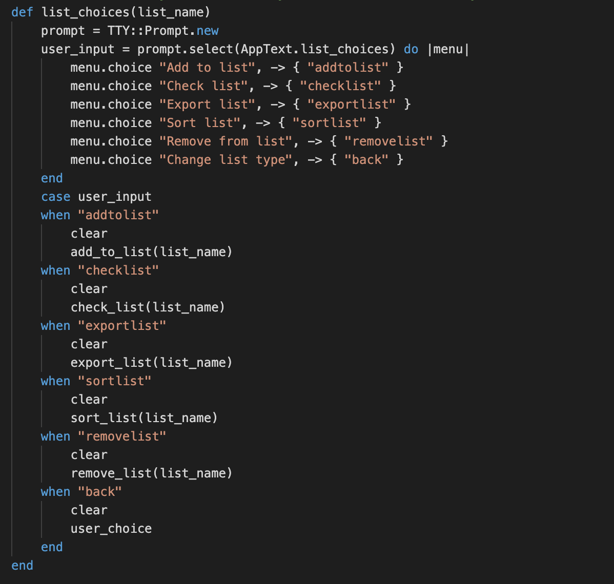
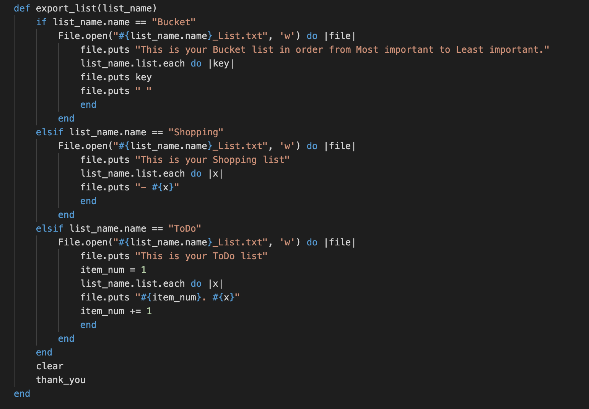

# Brandons List Making and Sorting App

### Description
---
This app is a simple list creation/sorting program, you can choose from Shopping List, Bucket List and ToDo List. You can Add to them, Check them, Remove an item and export the list to a Text file.

### Purpose
---
The purpose of the app is a nice quick way to create, sort and export lists to a simple text file.

### Functionality
---
My apps primary function is to create lists and sort them, but due to adding the Bucket list type I would like to get people to think about what they want to do in life.

### Instructions
---
You will require the tty-prompt, colourize and lolize gems to run this app.
You can run 'bundle install' in terminal to install the Gemfile.
Then run 'ruby sorting_app.rb' in terminal to launch the app.

If you have any issues you can always check the documentation in the following links for use and installation instructions.
- [tty-prompt](https://rubygems.org/gems/tty-prompt)
- [colorize](https://rubygems.org/gems/colorize)
- [lolize](https://rubygems.org/gems/lolize)

### Screenshots
---
Some samples of code.

## Design and Planning
---
### Project Plan
---
Before creating this app I had a few ideas, one of them being a Survival Horror Text Adventure.
I soon realised that the scope of that idea was way too large for the amount of time that I had, I also thought that creating something with more use instead of a game would be good for my portfolio.

Once I settled on the app I created a workflow/user diagram.

I had also started planning out functions, what I had to do and what else I want to add if I had time on my Trello board

### Pain Points
---
I realised early on it would be better doing something I could plan, test, code and polish than something with a large scope that would waste time and hinder my score.

I struggled to do planning and tests for some things as I was using a lot of class accessors for the list but managed to test what I could test.

### Improvements
---
1. I decided to put all the text into a seperate file so I can call it when I need it, making the code much easier to sort through.

2. Testing even the simple code was a good idea as it really sped things up

### Further Development
---
Given more time I would have liked to added:

1. More list types

2. More sorting options

3. Having multiple lists active at one time

4. Merging and loading previous lists
---
[You can find the source code here!](https:/github.com/brandonrobertson23/sort_app)

##### A Terminal App by Brandon