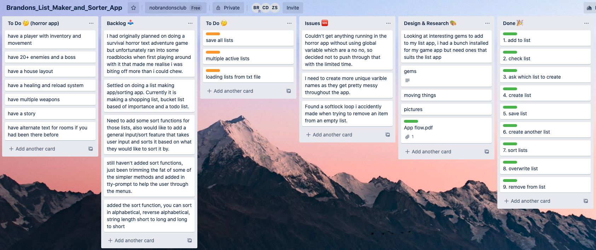

# Brandons List Making and Sorting App

### Description
---
This app is a simple list creation/sorting program, you can choose from Shopping List, Bucket List and ToDo List. You can Add to them, Check them, Remove an item and export the list to a Text file.

### Purpose
---
The purpose of the app is a nice quick way to create, sort and export lists to a simple text file.

### Functionality
---

### Instructions
---

### Screenshots
---

## Design and Planning
---

### Project Plan
---
Before creating this app I had a few ideas, one of them being a Survival Horror Text Adventure.
I soon realised that the scope of that idea was way too large for the amount of time that I had, I also thought that creating something with more use instead of a game would be good for my portfolio.

Once I settled on the app I created a workflow/user diagram.

I had also started planning out functions, what I had to do and what else I want to add if I had time on my Trello board

### Pain Points
---
I realised early on it would be better doing something I could plan, test, code and polish than something with a large scope that would waste time and hinder my score.

### Improvements
---
1. 
2. 
3. 
4. 
5. 

### Further Development
---
Given more time I would have liked to added:

1. More list types

2. More sorting options

3. Having multiple lists active at one time

4. Merging and loading previous lists
---
[You can find the source code here!]()

##### A Terminal App by Brandon